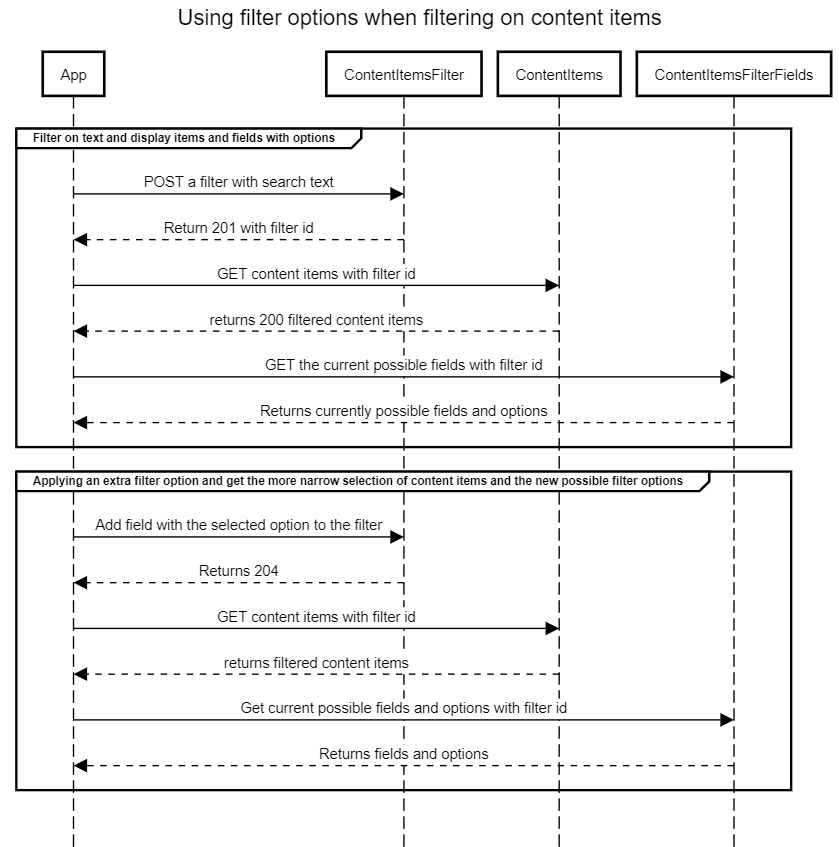

<!--
title Using filter options when filtering on content items

// Made in sequencediagram.org

group Filter on text and display items and fields with options
App->ContentItemsFilter: POST a filter with search text
App<--ContentItemsFilter: Return 201 with filter id
App->ContentItems: GET content items with filter id
App<--ContentItems: returns 200 filtered content items
App->ContentItemsFilterFields: GET the current possible fields with filter id
App<--ContentItemsFilterFields: Returns currently possible fields and options
end
group Applying an extra filter option and get the more narrow selection of content items and the new possible filter options
App->ContentItemsFilter: Add field with the selected option to the filter
App<--ContentItemsFilter: Returns 204
App->ContentItems: GET content items with filter id
App<--ContentItems: returns filtered content items
App->ContentItemsFilterFields: Get current possible fields and options with filter id
App<--ContentItemsFilterFields: Returns fields and options
end
-->